# mdgraph

Durable memory for a repository, in plain markdown. One file per thing worth
remembering, linked by name, kept on a dedicated `mdgraph` branch beside the
repo. The conventions live in [`SKILL.md`](SKILL.md) — that file is the
contract, this one is why it looks the way it does.



## Why not an extraction engine

LLM memory engines read your text, extract entities and relations, and store the
extraction. Writes amplify — roughly 26× tokens out per token stored on my own
corpus. The payload that survives is not your text: a finding like "NFP killed
at tick level, t=0.1–0.6, ZN-only" becomes triples that keep the nouns and drop
the number, the threshold, and the mechanism. And merging destroys history, so
you cannot rebuild the log from the graph.

mdgraph inverts each. You draw the boundaries, the payload never passes through
a model, and history is git.

## The shape

An entry is a markdown file whose frontmatter carries two fields:

```markdown
---
description: MGC Tokyo burst fade and continuation — five constructions, none survives a split
date: 2026-08-21
---

Five constructions, train/test split on the 2024-2026 cohort. Best cell reached
t=1.4 in-sample and 0.2 out. The burst itself is real; the direction is not.

Source: src/notebooks/reports/topics/mgc_tokyo/mgc_tokyo.ipynb
Relates: [[mgc-open-one-sided-commitment]]
```

**The filename is the identity and the link target.** Frontmatter is what makes
a file an entry, so a README at the vault root is ignored and no directory rule
can be violated.

**No hierarchy.** Files sit flat and reference each other by name. A tree would
demand each entry have exactly one home, and findings do not — an entry about a
range-breakout test on gold during Tokyo hours belongs under four topics at
once, and a tree forces you to pick one and lie about the rest. Links are
many-to-many and exact.

**No verdicts.** Entries carry numbers and mechanism; they never issue a
conclusion. Nothing is marked closed. A decision is recorded only when you can
name who or what made it — a stopping rule declared before the test ran, an
operator's call. A session that reads a result and concludes the work should
stop has not observed a decision, it has made one.

**Corrections are new entries** that link the old one. The old entry stays as
written; the record of what was believed is what makes the correction legible.
Two sessions writing at once touch different files, so there is nothing to
collide.

## Reading

Three exact operations. No embeddings, no similarity, no query layer:

```bash
grep -rn "<term>" <vault>              # lexical
grep -rl "\[\[<name>\]\]" <vault>      # structural: what references this
grep -h "^description:" <vault>/*.md   # the whole index, on demand
```

There is no query tool, and building one is not worth it: a graph traversal over
these links returns almost nothing, because most links point at entries nobody
has written yet. Everything a traversal would surface is already in the hook's
injection or one `grep -rl` away.

## Finding the vaults

A registry at `~/.claude/mdgraph-registry.txt` records which projects were
asked. It is not an inventory — a vault created without a registry line works
fine, because the hooks resolve through git rather than the file. Enumerate by
scanning the disk for both storage modes, sibling worktrees on the `mdgraph`
branch and plain `.mdgraph/` directories. Reading the registry as the list is
quiet when it is wrong: you conclude a project has no memory while its entries
sit in a vault the hooks have been indexing all along.

## Enforcement (hooks)

The contract binds only when loaded, so the read side is mechanical. Three
scripts under `hooks/`; copy them out and register two:

```bash
mkdir -p ~/.claude/hooks && cp hooks/*.sh ~/.claude/hooks/
```

```json
"hooks": {
  "SessionStart": [{"hooks": [{"type": "command", "command": "$HOME/.claude/hooks/mdgraph-index.sh"}]}],
  "Stop":         [{"hooks": [{"type": "command", "command": "$HOME/.claude/hooks/mdgraph-nudge.sh"}]}]
}
```

- `mdgraph-index.sh` (SessionStart) — prints **every** entry's description.
  Not a window: a window ages out the facts that bind longest, and a session
  that does not know a constraint exists cannot grep for one. Cost is about 8k
  tokens at 300 entries and 13k at 500; past that, move old entries into
  `archive/` where they stay greppable but stop being indexed.
- `mdgraph-nudge.sh` (Stop) — warns when code commits have outpaced the vault.
- `mdgraph-vault.sh` — the resolver both call; not registered itself.

Both scan `/root/Projects/*/`; change that glob to wherever your repos live.

## Converting an existing vault

`scripts/convert-to-entries.py` splits a `WORKLOG.md` vault into one file per
entry. It refuses to run on a vault with uncommitted changes, since another
session may be mid-write. It writes a tarball to `~/backups/mdgraph-preconvert/`
and records the pre-conversion commit before touching anything, reports every
`## ` heading it did not convert, and leaves the logs in place until you pass
`--remove-log`.

```bash
python3 scripts/convert-to-entries.py <vault>                    # dry run
python3 scripts/convert-to-entries.py <vault> --apply            # write entries, keep logs
python3 scripts/convert-to-entries.py <vault> --apply --remove-log
```

The index hook reads both shapes, so a vault works throughout the conversion.

## Install

```bash
mkdir -p ~/.claude/skills/mdgraph
cp SKILL.md ~/.claude/skills/mdgraph/
```

Then register the hooks above, and add one line to your always-loaded agent
instructions telling sessions the vault convention exists — a skill body only
loads when invoked.

## License

MIT
