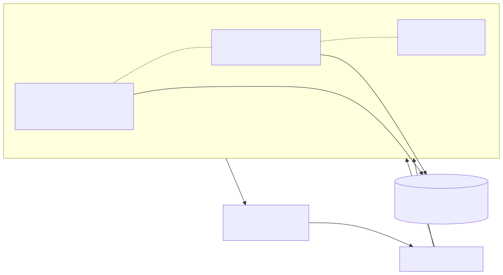

# mdgraph

Durable memory for a repository, in plain markdown. Each thing worth remembering
gets one file, entries link to each other by name, and the files live on a
dedicated `mdgraph` branch beside the repository. [`SKILL.md`](SKILL.md) is the
contract that sessions follow. This file explains why it is shaped the way it is.



## Why not an extraction engine

LLM memory engines read your text, pull out entities and relations, and store
what they extracted. Writing becomes expensive: on my own corpus, about 26 tokens
went out for every token stored. What survives is not your text either. A finding
like "NFP killed at tick level, t=0.1–0.6, ZN-only" turns into triples that keep
the nouns and drop the number, the threshold and the mechanism. And because the
engine merges what it stores, the history is gone, so you cannot rebuild the log
from the graph.

mdgraph turns each of those around. You decide where one entry ends and the next
begins, your words never pass through a model, and git keeps the history.

## The shape

An entry is a markdown file whose frontmatter has two fields:

```markdown
---
description: MGC Tokyo burst fade and continuation — five constructions, none survives a split
date: 2026-08-21
---

Five constructions, train/test split on the 2024-2026 cohort. Best cell reached
t=1.4 in-sample and 0.2 out. The burst itself is real. The direction is not.

- **Source:** src/notebooks/reports/topics/mgc_tokyo/mgc_tokyo.ipynb
- **Relates:** [[mgc-open-one-sided-commitment]]
```

**The filename is the identity and the link target.** Frontmatter is what makes
a file an entry, so a README at the root of the graph is simply ignored, and
there is no directory rule to break.

**Two kinds of reference, pointing in two directions.** `Source:` says where the
evidence lives, outside the graph: a notebook, a file in the repository, a URL.
`Relates: [[name]]` names another entry inside the graph. A `[[name]]` is written
only when that entry exists, so a reader can follow any bracket without checking
it first. Anything else is a path or plain text, which can be grepped just as
well.

**No hierarchy.** Files sit side by side and refer to each other by name. A tree
would give every entry exactly one home, and findings do not have one. An entry
about a range-breakout test on gold during Tokyo hours belongs under four topics
at once, and a tree would make you pick one and hide it from the other three.
Links can point anywhere, and they are exact.

**No verdicts.** Entries carry numbers and mechanism, and they never pronounce a
conclusion. Nothing is marked closed. A decision is recorded only when you can
name who or what made it: a stopping rule declared before the test ran, or the
operator's call. A session that reads a result and decides the work should stop
has not observed a decision. It has made one.

**A correction is a new entry** that links to the one it corrects. The earlier
entry stays as written, because knowing what was believed is what makes the
correction make sense. Two sessions writing at the same time touch different
files, so they never collide.

## Reading

Reading takes three exact operations. There are no embeddings, no similarity
search and no query layer:

```bash
grep -rn "<term>" <graph>              # find a word
grep -rl "\[\[<name>\]\]" <graph>      # find what links to an entry
grep -h "^description:" <graph>/*.md   # the whole index
```

A query tool would not earn its keep. Walking the links returns very little,
because most links point at entries nobody has written yet, and whatever a walk
would find is already in the index or one `grep -rl` away.

## Finding the graphs

A registry at `~/.claude/mdgraph-registry.txt` records which projects have been
asked whether they want a graph. It is not a list of graphs. A graph created
without a registry line works fine, because the hooks find graphs through git,
not through that file. To list every graph, scan the disk for both kinds:
worktrees on the `mdgraph` branch, and plain `.mdgraph/` directories. Treating
the registry as the list fails silently when it is incomplete: you conclude that
a project has no memory while the hooks have been indexing its entries all
along.

## Install

```bash
./install.sh
```

This copies the skill to `~/.claude/skills/mdgraph/` and the three hook scripts
to `~/.claude/hooks/`. It registers `mdgraph-index.sh` on SessionStart and
`mdgraph-nudge.sh` on Stop in `~/.claude/settings.json`, leaving your other hooks
alone. It also creates a plain host graph at `~/.mdgraph` for work that is not
about one repository. The hooks look for repositories under `/root/Projects`, so
set `PROJECTS` if yours are elsewhere.

Files are copied, never symlinked. A skill's body is loaded only when a session
calls for it, so add one line to your always-loaded agent instructions saying
that the graph convention exists.

## The hooks

A contract only binds a session that has loaded it, so the hooks handle what
cannot be left to chance.

- `mdgraph-index.sh` (SessionStart) prints one line per graph on the host: its
  name, its entry count and its path, about 100 tokens in all. It prints no
  contents, because a graph is memory for one repository, and a session that has
  not entered that repository has no use for it. A session that does enter it
  reads the index with `grep -h "^description:" <graph>/*.md`.
- `mdgraph-nudge.sh` (Stop) warns when the code has had more commits than the
  graph has had entries.
- `mdgraph-resolve.sh` finds a repository's graph. The other two call it, and it
  is not registered on its own.

## Converting an existing graph

`scripts/convert-to-entries.py` splits a `WORKLOG.md` graph into one file per
entry. It refuses to run on a graph with uncommitted changes, since another
session may be halfway through writing. Before touching anything, it writes a
tarball to `~/backups/mdgraph-preconvert/` and records the commit it started
from. It reports every `## ` heading it did not convert, and it leaves the logs
in place until you pass `--remove-log`.

```bash
python3 scripts/convert-to-entries.py <graph>                    # dry run
python3 scripts/convert-to-entries.py <graph> --apply            # write entries, keep logs
python3 scripts/convert-to-entries.py <graph> --apply --remove-log
```

Keep `--apply` on the second run. Entries that were already written are
recognised and skipped, so the run gets to the removal step. A file that exists
with different content still makes it stop, so a real name collision can never
be overwritten.

**Commit before renaming anything.** New entry files are untracked until the
first commit, so `git mv` on one fails with "not under version control". Grep
for links to the old name first, commit, then rename.

The index hook reads both formats, so a graph keeps working throughout the
conversion.

## License

MIT
